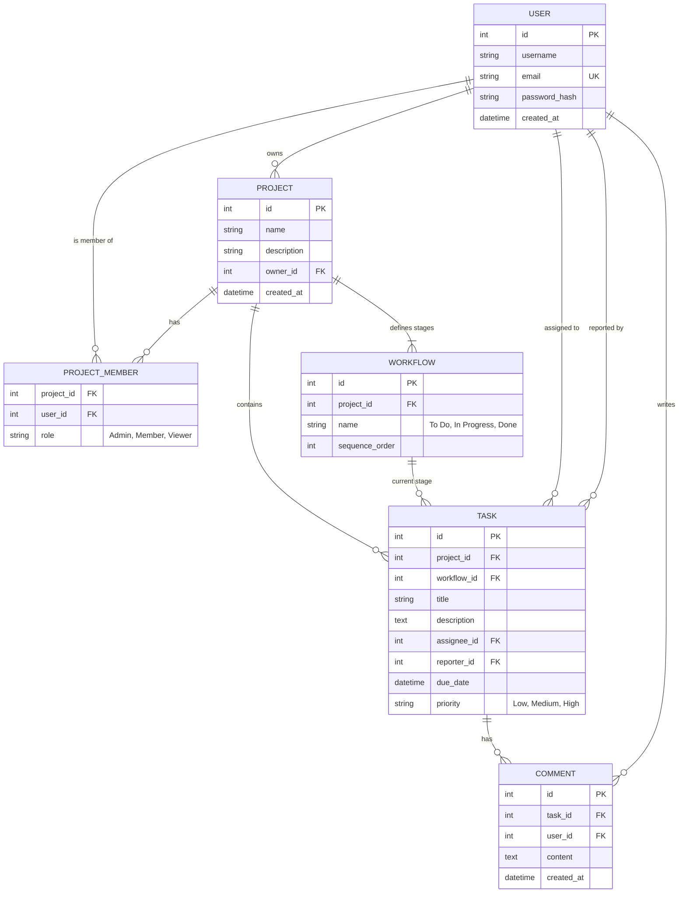

# Entity Relationship Diagram

```mermaid
erDiagram
    USER ||--o{ PROJECT : owns
    USER ||--o{ PROJECT_MEMBER : "is member of"
    PROJECT ||--o{ PROJECT_MEMBER : has
    
    PROJECT ||--|{ WORKFLOW : "defines stages"
    PROJECT ||--o{ TASK : contains
    
    WORKFLOW ||--o{ TASK : "current stage"
    
    USER ||--o{ TASK : "assigned to"
    USER ||--o{ TASK : "reported by"
    
    TASK ||--o{ COMMENT : has
    USER ||--o{ COMMENT : writes

    USER {
        int id PK
        string username
        string email UK
        string password_hash
        datetime created_at
    }

    PROJECT {
        int id PK
        string name
        string description
        int owner_id FK
        datetime created_at
    }

    PROJECT_MEMBER {
        int project_id FK
        int user_id FK
        string role "Admin, Member, Viewer"
    }

    WORKFLOW {
        int id PK
        int project_id FK
        string name "To Do, In Progress, Done"
        int sequence_order
    }

    TASK {
        int id PK
        int project_id FK
        int workflow_id FK
        string title
        text description
        int assignee_id FK
        int reporter_id FK
        datetime due_date
        string priority "Low, Medium, High"
    }

    COMMENT {
        int id PK
        int task_id FK
        int user_id FK
        text content
        datetime created_at
    }
```
