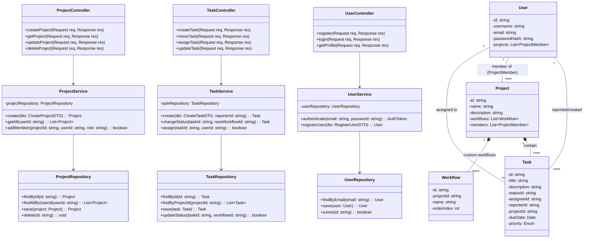

# Class Diagram: Project Workflow System

```mermaid
classDiagram
    %% --- Controllers ---
    class ProjectController {
        +createProject(Request req, Response res)
        +getProject(Request req, Response res)
        +updateProject(Request req, Response res)
        +deleteProject(Request req, Response res)
    }

    class TaskController {
        +createTask(Request req, Response res)
        +moveTask(Request req, Response res)
        +assignTask(Request req, Response res)
        +updateTask(Request req, Response res)
    }

    class UserController {
        +register(Request req, Response res)
        +login(Request req, Response res)
        +getProfile(Request req, Response res)
    }

    %% --- Services ---
    class ProjectService {
        -projectRepository: ProjectRepository
        +create(dto: CreateProjectDTO): Project
        +getAll(userId: string): List~Project~
        +addMember(projectId: string, userId: string, role: string): boolean
    }

    class TaskService {
        -taskRepository: TaskRepository
        +create(dto: CreateTaskDTO, reporterId: string): Task
        +changeStatus(taskId: string, newWorkflowId: string): Task
        +assign(taskId: string, userId: string): boolean
    }

    class UserService {
        -userRepository: UserRepository
        +authenticate(email: string, password: string): AuthToken
        +registerUser(dto: RegisterUserDTO): User
    }

    %% --- Repositories ---
    class ProjectRepository {
        +findById(id: string): Project
        +findAllByUserId(userId: string): List~Project~
        +save(project: Project): Project
        +delete(id: string): void
    }

    class TaskRepository {
        +findById(id: string): Task
        +findByProjectId(projectId: string): List~Task~
        +save(task: Task): Task
        +updateStatus(taskId: string, workflowId: string): boolean
    }

    class UserRepository {
        +findByEmail(email: string): User
        +save(user: User): User
        +exists(id: string): boolean
    }

    %% --- Models ---
    class User {
        -id: string
        -username: string
        -email: string
        -passwordHash: string
        -projects: List~ProjectMember~
    }

    class Project {
        -id: string
        -name: string
        -description: string
        -workflows: List~Workflow~
        -members: List~ProjectMember~
    }

    class Task {
        -id: string
        -title: string
        -description: string
        -statusId: string
        -assigneeId: string
        -reporterId: string
        -projectId: string
        -dueDate: Date
        -priority: Enum
    }

    class Workflow {
        -id: string
        -projectId: string
        -name: string
        -orderIndex: int
    }

    %% --- Relationships ---
    ProjectController --> ProjectService
    TaskController --> TaskService
    UserController --> UserService

    ProjectService --> ProjectRepository
    TaskService --> TaskRepository
    UserService --> UserRepository

    Project "1" *-- "many" Workflow : custom workflows
    Project "1" *-- "many" Task : contain
    User "1" -- "many" Task : assigned to
    User "1" -- "many" Project : member of (ProjectMember)
    User "1" -- "many" Task : reported/created
```
