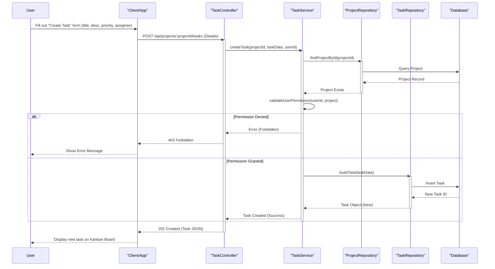

# Sequence Diagram: Create Task in Project

```mermaid
sequenceDiagram
    participant User
    participant Frontend as "Client/App"
    participant TC as "TaskController"
    participant TS as "TaskService"
    participant PR as "ProjectRepository"
    participant TR as "TaskRepository"
    participant DB as "Database"

    User->>Frontend: Fill out "Create Task" form (title, desc, priority, assignee)
    Frontend->>TC: POST /api/projects/:projectId/tasks (Details)
    activate TC
    
    TC->>TS: createTask(projectId, taskData, userId)
    activate TS
    
    TS->>PR: findProjectById(projectId)
    activate PR
    PR->>DB: Query Project
    DB-->>PR: Project Record
    PR-->>TS: Project Exists
    deactivate PR

    TS->>TS: validateUserPermission(userId, project)
    alt Permission Denied
        TS-->>TC: Error (Forbidden)
        TC-->>Frontend: 403 Forbidden
        Frontend-->>User: Show Error Message
    else Permission Granted
        TS->>TR: buildTask(taskData)
        activate TR
        TR->>DB: Insert Task
        DB-->>TR: New Task ID
        TR-->>TS: Task Object (New)
        deactivate TR
        
        TS-->>TC: Task Created (Success)
    end
    deactivate TS

    TC-->>Frontend: 201 Created (Task JSON)
    deactivate TC
    
    Frontend-->>User: Display new task on Kanban Board
```
