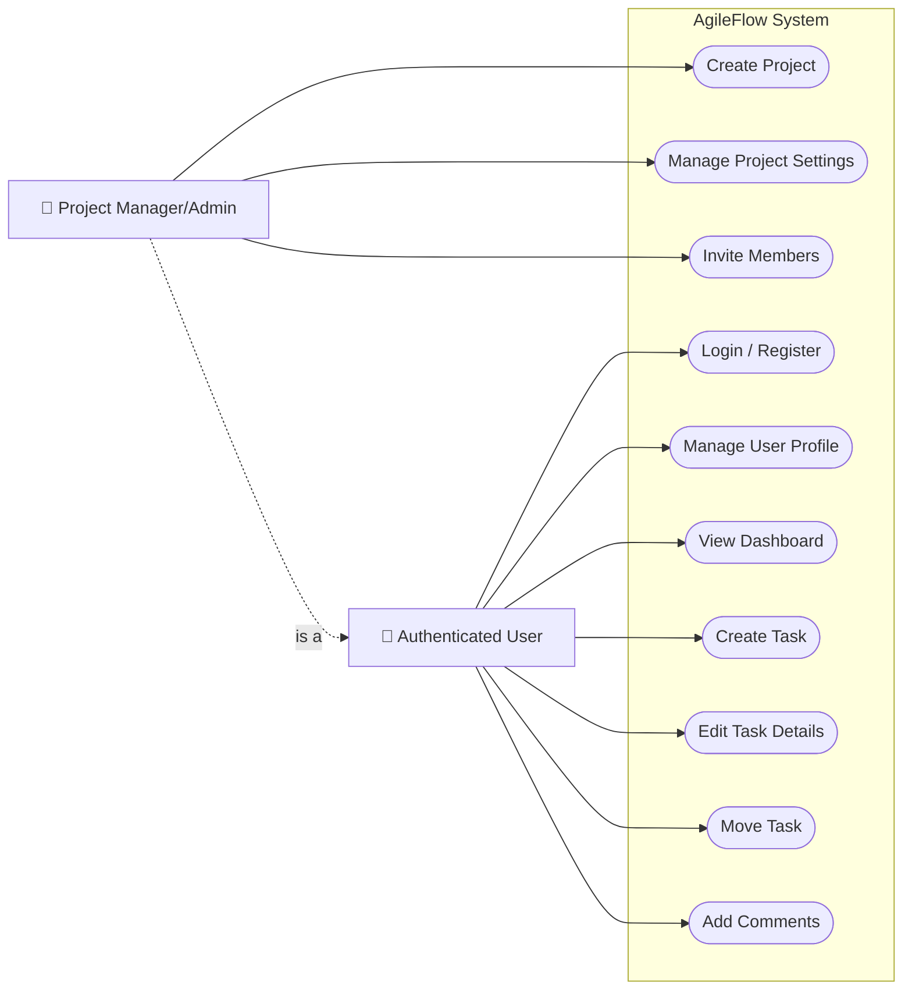

# Use Case Diagram

```mermaid
flowchart LR
    %% Actors
    User["👤 Authenticated User"]
    Admin["👤 Project Manager/Admin"]

    %% System Boundary
    subgraph AgileFlow_System ["AgileFlow System"]
        direction TB
        UC1(["Login / Register"])
        UC2(["Manage User Profile"])
        UC9(["View Dashboard"])
        UC3(["Create Project"])
        UC4(["Manage Project Settings"])
        UC5(["Invite Members"])
        UC6(["Create Task"])
        UC7(["Edit Task Details"])
        UC8(["Move Task"])
        UC10(["Add Comments"])
    end

    %% Relationships
    %% User Connections
    User --> UC1
    User --> UC2
    User --> UC9
    User --> UC6
    User --> UC7
    User --> UC8
    User --> UC10

    %% Admin Connections (includes User functions + extra)
    Admin --> UC3
    Admin --> UC4
    Admin --> UC5
    
    %% Representing Inheritance (Admin is a User)
    Admin -.->|is a| User
```
